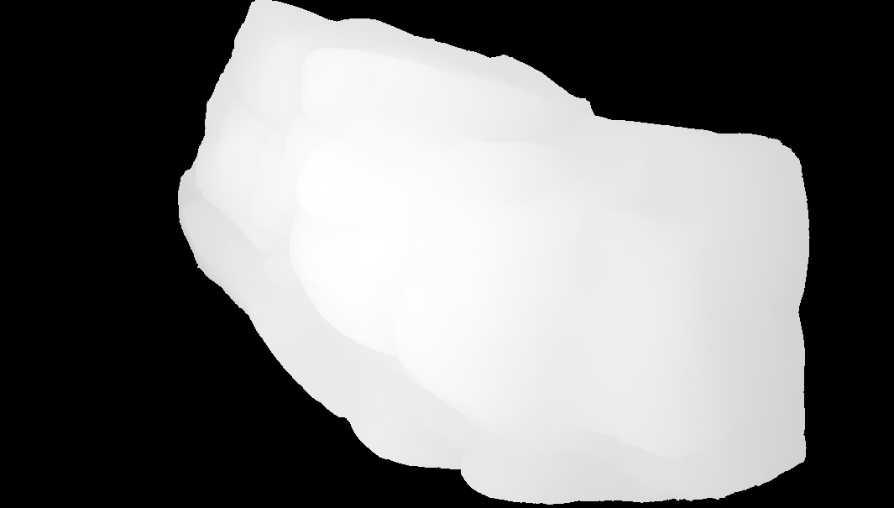
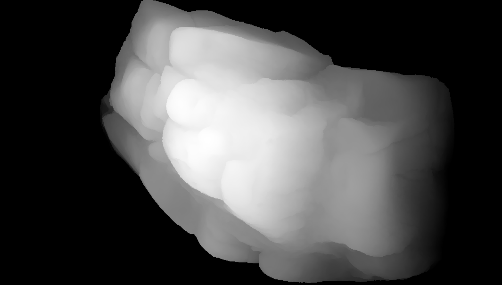

# MeshToImage
Being an attempt to load high-res meshes and turn viewing angle into one or two images containing RGB and height info.
The project stems from an idea to use detailed meshes of organic objects (such as from the Megascans project) and convert them to terrain as a means to produce decent terrain very quickly. The reason is that the other quick alternative, procedurally generated landscapes, simply look too artificial without extensively reworking the result to the point that you might as well have created it manually anyway.  

This project is written in C++ using VS2022 and uses OpenGL to render meshes. Compilation of the .exe-files is done by VS2022 but there are no Windows dependencies so will hopefully work on different systems.

Because of its limited scope, both the renderer and mesh importers are very basic. Included libraries are GLFW and GLEW to create the renderer with GLM to help. STB to load textures, the fbx sdk to load .fbx and json.hpp to parse .gltf. The project is currently limited to importing a single mesh: no submeshes. Since my experience with mesh-files is rather limited, it is very probable that I have not taken various .fbx and .gltf structures into account. It works with those meshes I have to test with.

Noticing how the fbx sdk bloats the build, we decided to make a leaner version with only .gltf and .obj support. The resulting .exe is about 1 mb. Both types are supplied in the repo.

Basic code by Borealian (all the bugs are belong to me!).  
Refactoring by Johno (if it looks great, he did it).

## Remaining issues
.OBJ-files that are not Wavefront .obj turn up in the mesh list. They do not crash the program however.

Panning (in ortho-mode) changes the perspective (sounds weird but you'll see what I mean).

Low resolution texture with high resolution mesh fails to bind: mesh renders black.

Image output is limited to raw .tga for RGB and ascii .pgm for 16-bit grayscale.

## How it is used
On startup, the program scans its current directory and subdirectories for .obj, .gltf and .fbx files (the latter only with the full version) and populates a list with the result. It also loads the first item in this list and provides up to the first 25 files as a visible list on the left in the program's window. It should be pointed out that the program will only load a single mesh file at a time, with just a main texture. For gltf files, the program will attempt to use the internal file path for the base colour texture. If no such path exists, the program will try to find a texture with a filename based on the mesh-filename in the same directory as the mesh-file. This, incidentally, is how the program searches for textures for .fbx and .obj files. Worth noting also is that the meshes are, on program startup, loaded to 1:100 scale. This is because megascan files are typically too large to fit in the space of this renderer. However, the left/right keys will decrease/increase scale in runtime.
Meshes will be presented unlit in perspective and can be zoomed and rotated using a mouse. When the user is satisfied with how the mesh is presented, it is possible to switch to orthographic mode with further camera controls mapped to the keyboard, and take a snapshot and save RGB + Z to image files. While it is possible to take snapshots in perspective view, the resulting depth data has much lesser quality. Also, please note that max depth is at the far clipping plane, meaning you will typically want the far clipping plane to be as close to the mesh as possible for better depth data. (Holding Z will move the far clipping plane closer to the camera).

Many of the prime candidates among mesh-files for this project are far too big, hence it defaults to 0.01 scale. This means small meshes may be hard to see, even zoomed in.

While only 25 meshes are visible at the time in the list, once you navigate below the 20th line the list will "scroll" down to show further files. Note that taking snapshots will momentarily hide the text so it doesn't end up in your captures.

## Controls
Left mouse button and move mouse: rotate object.

Right mouse button and move mouse: zoom in/out.

Up/Down arrows to move in the list of meshes.

Left/Right arrows to reload mesh in smaller/greater scale. Range 1:1000 to 1:1.

WASD to pan the camera.

Q/E to zoom in/out in orthographic mode.

Z/X to limit/extend depth of field in orthographic mode.

V to toggle wireframe mode.

Space to toggle between orthographic and perspective.

Return to take a snapshot.

## Build it yourself?
Note that the lib folder in the repo contains the necessary includes of all libraries apart from fbx. Also note that GLM, STB and json.hpp are header only libraries so should require minimal effort to include (STB has a couple of extra rules). GLFW and GLEW need to be linked but this process is well documented elsewhere, as is linking the fbx sdk (I found https://www.youtube.com/watch?v=oIKnBVP2Jgg helpful). If making a md-build you need to change the pragmas relating to fbx in mesh.cpp to md-libs. You need to edit those pragmas regardless to accommodate your file paths. If you are unfamiliar with how the stdafx-header is implemented, there should be ample instructions for this around the web also.

### OpenGL libs
GLEW (https://glew.sourceforge.net/)  
GLFW (https://www.glfw.org/download)  
GLM (https://github.com/g-truc/glm)

### Texture loading lib
STB (https://github.com/nothings/stb)

### FBX SDK
fbxsdk (https://aps.autodesk.com/developer/overview/fbx-sdk)

### JSON parser
json.hpp (https://github.com/nlohmann/json)
